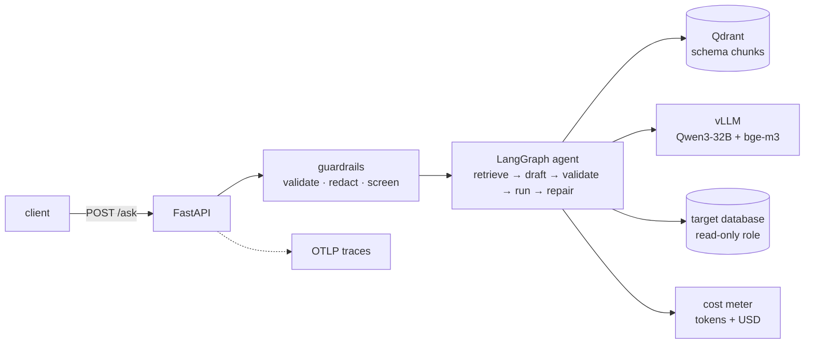

# natural-text-to-sql

[](https://github.com/sameeranamarnath/natural-text-to-sql/actions/workflows/ci.yml)

Turn a plain-English question into SQL, run it against a database, and explain the
result in a sentence.

The generation is the easy part. What is built around it is the interesting part:
a read-only gate that fails closed, a repair loop that reads the database's own
errors, PII redaction before anything reaches a model, per-request cost
accounting, and an offline eval harness that gates every pull request.

| Path | What it is |
| --- | --- |
| `ai/` | the service: LangGraph agent, guardrails, cost meter, evals, FastAPI |
| `text-to-sql.py` | the original single-shot Streamlit script, kept for reference |

## Architecture



The agent graph:

```
retrieve_schema -> draft_sql -> validate_sql --> run_sql --> summarise -> END
                                     |               |
                                     +--> repair_sql <+
                                          (capped retries)
```

`retrieve_schema` pulls only the tables a question is likely to need out of
Qdrant, so the prompt does not carry the entire schema. `validate_sql` is the
read-only gate. `run_sql` captures the database's error verbatim, and
`repair_sql` hands it back to the model, up to `MAX_REPAIR_ATTEMPTS`.

## Results

| Signal | Value |
| --- | --- |
| Unit tests | 85 passing, ~0.1s, with no model, database or vector store |
| Offline evals | 10/10 golden cases pass the rubric |
| Lint, format, types | `ruff check`, `ruff format --check` and `mypy` all clean |
| CI gate | ~20s, because the safety and eval modules are standard-library only |

Reproduce all of it locally:

```bash
cd ai && pip install -e ".[dev]"
ruff check . && ruff format --check . && mypy && pytest && python -m evals.run
```

## Design decisions

Short records live in `docs/adr/` for the choices that are not self-evident:

- [1. Use LangGraph for the SQL repair loop](docs/adr/0001-langgraph-for-the-repair-loop.md)
- [2. Read-only gate in code, least-privilege role in the database](docs/adr/0002-read-only-gate-and-least-privilege-role.md)

## Evals

Evaluation is what separates a demo from a system. `ai/evals/` holds a golden
dataset, deterministic scorers and a runner:

```bash
python -m evals.run           # offline: score the reference SQL (no model, no DB)
python -m evals.run --live    # run the agent against vLLM + Qdrant and score it
```

The offline path needs nothing beyond pytest, so it runs on every pull request. It
doubles as a self-test: if the rubric rejects its own reference answers then the
rubric is wrong, and the run fails.

Cases assert non-functional behaviour as well as correctness. `refuses-write` and
`refuses-injection` require the agent to *refuse*, and are scored with
`must_not_contain` - a system that answers "delete every film" with `DELETE` has
failed, not been helpful.

See [`ai/evals/README.md`](ai/evals/README.md) for the taxonomy and for how to
refresh the dataset from production traces.

## Observability

Every model call emits an OpenTelemetry span using the GenAI semantic conventions
(`gen_ai.request.model`, `gen_ai.usage.input_tokens`, `gen_ai.usage.output_tokens`),
and the database call emits a `db.query` span carrying the row count. Set
`OTEL_EXPORTER_OTLP_ENDPOINT` to ship them anywhere OTLP-compatible - Langfuse,
Jaeger, Tempo or Honeycomb.

Tracing is optional by construction: `observability.py` degrades to a no-op when
the SDK is absent, so a missing collector can never stop the service from starting.

## Cost

Every response reports what it cost:

```json
{"answer": "...", "sql": "select ...", "cost_usd": 0.00214}
```

`GET /usage` returns the process total against the optional `LLM_BUDGET_USD`
ceiling. Token counts come from the provider's own `usage_metadata`; where a
client does not expose them the meter records zero rather than guessing, because an
invented number makes a cost dashboard worse than useless.

## Security

| Threat | Control |
| --- | --- |
| Destructive SQL | read-only gate: a single SELECT/WITH, DDL/DML rejected |
| Prompt injection | pattern screening that fails closed |
| PII or credentials reaching prompts, vectors or logs | redaction before the model sees them |
| Runaway spend | per-request metering and a budget ceiling |

The read-only gate is a gate, not a sandbox - the control that actually matters is
a least-privilege database role. [SECURITY.md](SECURITY.md) has the full threat
model; [ADR 2](docs/adr/0002-read-only-gate-and-least-privilege-role.md) explains
why the defence is layered that way.

## Quickstart

Bring up the whole stack (vLLM for chat and embeddings, Qdrant, the service):

```bash
docker compose -f docker-compose.ai.yml up
curl -X POST localhost:8080/ingest
curl -X POST localhost:8080/ask -H 'content-type: application/json' \
     -d '{"question": "which films were released in 1994?"}'
```

vLLM needs a GPU. Point `LLM_BASE_URL` at any OpenAI-compatible endpoint and drop
the `vllm` services for a CPU-only deployment.

## API

| Method | Path | Purpose |
| --- | --- | --- |
| `GET` | `/health` | liveness and the resolved model names |
| `POST` | `/ingest` | read the schema from `DATABASE_URL` into Qdrant |
| `POST` | `/ask` | ask a question; returns answer, SQL, rows and cost |
| `POST` | `/ask/stream` | the same, as SSE with one event per graph node |
| `GET` | `/usage` | cumulative tokens and spend, against the budget |
| `GET` | `/search?q=` | retrieval only, for seeing what the agent saw |

## Configuration

Every value is environment-overridable; see `ai/config.py`.

| Variable | Default | Purpose |
| --- | --- | --- |
| `LLM_BASE_URL` / `LLM_MODEL` | `http://vllm:8000/v1` / `Qwen/Qwen3-32B` | chat model |
| `EMBED_BASE_URL` / `EMBED_MODEL` | `http://vllm:8000/v1` / `BAAI/bge-m3` | embeddings |
| `QDRANT_URL` / `QDRANT_COLLECTION` | `http://qdrant:6333` / `sql_schema_chunks` | retrieval |
| `DATABASE_URL` | `sqlite:///imdb-movie.sqlite` | the database to query |
| `MAX_REPAIR_ATTEMPTS` | `3` | cap on the repair loop |
| `LLM_BUDGET_USD` | unset | optional spend ceiling, reported by `/usage` |
| `OTEL_EXPORTER_OTLP_ENDPOINT` | unset | tracing target |

## Project layout

```
ai/
  config.py          settings
  guardrails.py      redaction, injection screening, read-only gate   (stdlib only)
  costs.py           token accounting and budget                       (stdlib only)
  observability.py   GenAI-convention spans, optional OTel             (stdlib only)
  graph.py           the LangGraph agent
  store.py           Qdrant access
  llm.py             model clients
  main.py            FastAPI surface
  evals/             golden dataset, scorers, runner
  tests/             85 unit tests
docs/adr/            architecture decision records
```

## Contributing

See [CONTRIBUTING.md](CONTRIBUTING.md) - Conventional Commits, ruff, mypy, pytest.

## What I would do next

- Replace pattern-based injection screening with a classifier, and measure its
  precision against a labelled adversarial set.
- Add an LLM-as-judge scorer for answer quality, calibrated against ~50
  hand-scored examples, and record the correlation before trusting it.
- Rebuild the golden set from real traces rather than hand-written cases.
- Move cost accounting out of process state, so it survives multiple replicas.

## Licence

MIT - see [LICENSE](LICENSE).

